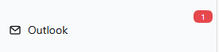

# dsh-outlook

> **在 IT 不给你 Graph API 权限的公司电脑上，让 AI 直接操作你正在用的 Outlook。**
> 零凭据 · 零管理员权限 · 发任何东西都先问你。

[](https://www.npmjs.com/package/@deepseek-ai/dsh) [](https://support.microsoft.com/en-us/office) [](./LICENSE) [](#它会交付什么)

*Zero-credential Outlook automation for AI agents on Windows: drives your local desktop Outlook client via COM. No Graph API app registration, no SMTP passwords, no tenant admin rights — everything that leaves the machine passes a three-layer human approval gate.*

## 你什么时候需要它？

1. **公司电脑装了经典版 Outlook，但 IT 不让你注册 Azure 应用**——所有 Graph API 方案（outlook-mcp 等）第一步就死在 app registration 上，这个插件不需要：它直接驱动你已经登录的桌面客户端。
2. **想让 AI 当邮件秘书**：早上到工位问一句"有什么新邮件"，它读给你听；说"回复这封，就说周三可以"，它起草、引用原文、弹窗给你过目后发出。
3. **要约会议但不知道谁有空**：一句话查同事 free/busy、搜会议室空闲时段，邀请发出前同样先给你确认。

## 它会交付什么？

**18 个 AI 工具**（读操作自动执行；任何外发动作必须过确认弹窗）：

| 工具 | 功能 | 守门 |
|---|---|---|
| `outlook_check_new` | 新邮件到达推送（侧边栏角标同步） | 只读 |
| `outlook_search_mail` | 搜邮件（天数/文件夹/发件人/主题/日期区间/收件人侧），结果可贴点击打开链接 | 只读 |
| `outlook_read_mail` | 读全文（正文/收件人/附件名，超长截断） | 只读 |
| `outlook_open_mail` | 在桌面 Outlook 窗口中打开邮件（标记已读、角标减 1） | 本地动作 |
| `outlook_account` | 当前账户名/SMTP | 只读 |
| `outlook_draft_mail` | 建草稿（**永不发送**，可带附件） | 安全 |
| `outlook_send_mail` | 发邮件 | 三层人审 |
| `outlook_reply_mail` | 回复/全部回复/转发（自动引用原文，转发带原附件） | 三层人审 |
| `outlook_calendar_query` | 未来 N 天日程（含例会展开） | 只读 |
| `outlook_calendar_create` | 个人日程直接建；带参会人则发邀请 | 邀请需人审 |
| `outlook_meeting_requests` | 待响应的会议邀请列表 | 只读 |
| `outlook_respond_meeting` | 接受/暂定/拒绝会议邀请 | 人审（通知组织者） |
| `outlook_meeting_update` | 改日程/会议（组织者自动通知参会人） | 人审 |
| `outlook_meeting_cancel` | 取消会议（通知参会人）/删个人日程 | 人审 |
| `outlook_search_people` | 通讯录（GAL）搜人名/邮箱/别名 | 只读 |
| `outlook_freebusy` | 同事忙闲时段（30 分钟粒度） | 只读 |
| `outlook_search_rooms` | 会议室搜索 + 指定时段空闲检查 | 只读 |
| `outlook_save_attachment` | 附件保存到本地（防路径穿越、不覆盖同名） | 本地写 |

**外加一个侧边栏角标**：新邮件到达时 Outlook 按钮出现红色计数，点击弹层列出最新到达；**点击弹层中的邮件可直接在 Outlook 中打开**（自动标记已读、角标减 1），悬停预览。**会话聊天里的 `[打开]` markdown 链接同样点击即开**：插件在页面内拦截左键点击并原地触发（无新标签页，页面底部 toast 提示）。

| 展开态（外置角标） | 收起态（圆钮内红点） |
|---|---|
|  |  |

## 快速开始

```sh
# npm 短名安装（推荐）
dsh plugin --profile web add dsh-outlook
# 或直接从 GitHub
dsh plugin --profile web add https://github.com/UnknowCao/dsh-outlook
```

然后重启 profile（或依赖 `patchReload: live`）。没有第二步——不配置凭据、不注册应用、不改 Outlook 设置。

**前置条件**：Windows + 经典桌面版 Outlook（Win32 `OUTLOOK.EXE`）已登录 + Windows PowerShell 5.1（系统自带）。无需租户管理员权限。

## 触发方式（装完试着说）

- "有什么新邮件？"
- "搜一下上周张三发的关于交付物的邮件"
- "把这封转给李四，附言说请他确认"
- "帮我约下周三和王五的会，先看看他什么时候有空"
- "找一间明天下午两点到三点空闲的宁波会议室"

## 它和同类方案有什么不同？

| | dsh-outlook | Graph API 类（outlook-mcp 等） | SMTP 类（mcp-server-email） |
|---|---|---|---|
| 需要注册 Azure 应用 | ❌ 不需要 | ✅ 必须（企业常被 IT 锁死） | ❌ |
| 需要邮箱密码/凭据 | ❌ | OAuth token | ✅ SMTP 密码 |
| 读你"正在用的"客户端状态（未读/规则/本地文件夹） | ✅ | 部分 | ❌ |
| 外发前人工确认 | 三层门（见下） | 视实现 | 视实现 |
| 平台 | 仅 Windows 经典版 | 任意 | 任意 |

## 安全边界

**任何离开这台机器的动作——发邮件、发会议邀请——都要过三道互相独立的门：**

1. **两轮确认协议**：第一次调用只返回"将要发送什么"的明细，AI 必须原样展示给你、你明确允许后，带 `confirmed:true` 重试才执行；
2. **内容哈希绑定**：确认时展示的内容与最终发送的内容做 SHA-256 比对——给你看 A、实际发 B 的偷换在 host 层即被强制退回重新确认；
3. **桥接层令牌**：PowerShell 桥独立拒绝一切没有一次性 `OLK_CONFIRM` 令牌的发送路径——即使未来某个 bug 或新工具绕过前两层，令牌不出，邮件不发。

**它不会做的事**：不静默发送任何内容；不保存/不回传邮箱凭据（根本不接触）；草稿永不自动发送；附件保存拒绝路径穿越、拒绝覆盖已有文件。

已知边界：`/olk-notify/*` 路由仅本机可达并做同源校验（非浏览器/导航类请求与其它本机进程仍可读新邮件主题元数据）；会话内"点击打开"链接里的端口不影响普通左键点击（client 按路径名拦截后向页面自身 origin 发送）；`/olk-notify/open` 为 POST-only，修饰键/中键点击聊天链接会得到 405（有意行为，`outlook_open_mail` 工具不受影响）；多标签页共享同一待读队列；用 `OLK_WATCH=0` 环境变量可关闭新邮件监听。

## 文件结构

```
index.js          宿主半：18 个工具注册、两轮确认、内容哈希、watcher 管理、状态/打开路由
client.js         浏览器半：sidebar.footer.action 槽位按钮、角标、弹层（React Portal，点击打开）
lib/olk.ps1       COM 桥：全部 Outlook 操作 + 令牌门 + 本地化怪癖（见文件头注释）
lib/watch.ps1     NewMailEx 常驻监听：推送新邮件到达，崩溃 30s 自愈
cordis.patch.yml  宿主行声明
TESTCASES.md      49 个测试用例（链路/渲染/共存/路由/点击打开/链接拦截/已知边界）
CHANGELOG.md      版本叙事（为什么改）
```

诊断日志：`%TEMP%\dsh-outlook-watch-debug.log`（1MB 自动截断轮转）。

## 验证与测试

- 49 个用例覆盖全链路（[TESTCASES.md](./TESTCASES.md)），自动化项全部通过实测：新邮件推送→角标→清空、watcher 强杀 30s 自愈、两种确认偷换攻击拦截、路由 405/413、日志轮转截断、打开即已读、GBK 代码页回归、聊天链接点击拦截（v2.11.0 H 组）；
- COM 怪癖（Jet/DASL 双阶段过滤、Restrict 日期格式、IncludeRecurrences 的 MaxInt 计数、PS 5.1 stdin 编码）全部编码在 `lib/olk.ps1` 并经真实 Exchange 环境验证。
